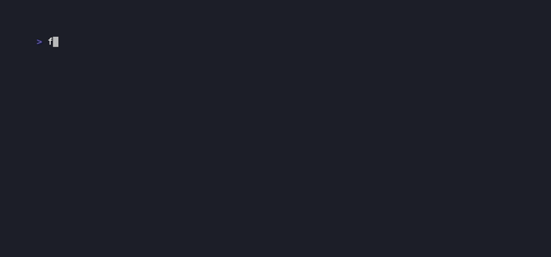
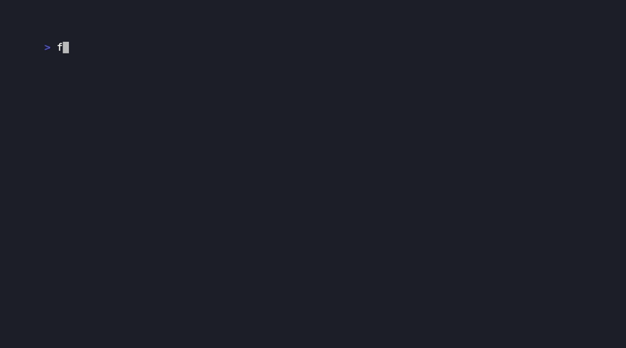
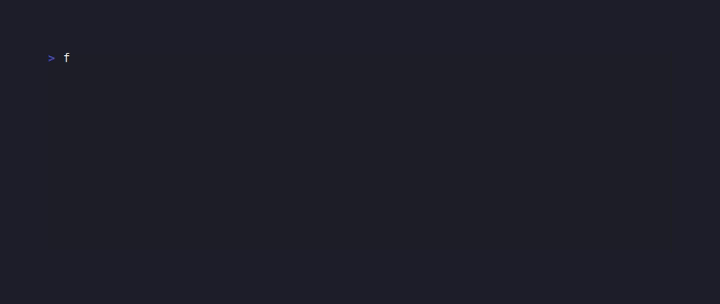
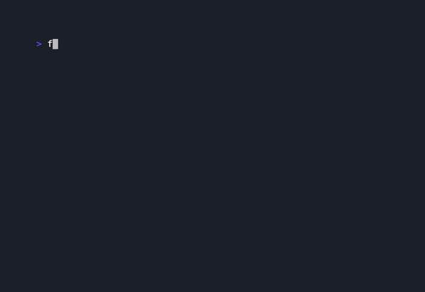
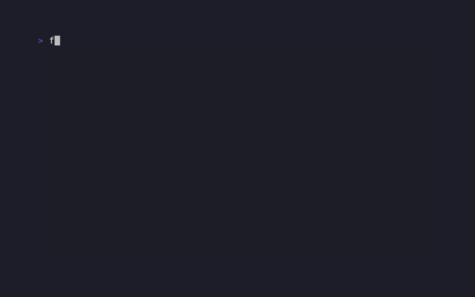
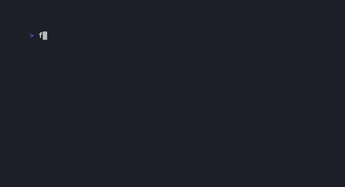
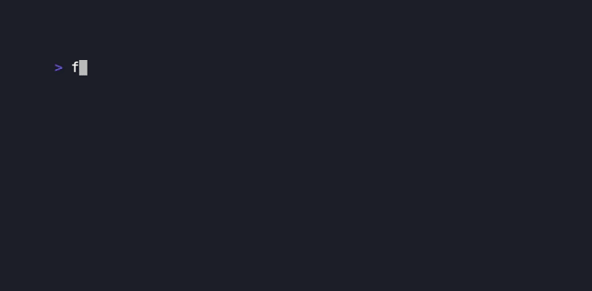

# dart_tui

[](https://pub.dev/packages/dart_tui)
[](https://dart.dev)
[](LICENSE)

Elm-style terminal UI framework for Dart, inspired by [Bubble Tea](https://github.com/charmbracelet/bubbletea).

Build rich, interactive CLI applications with a clean **Model–Update–View** architecture, a full component library, and Lipgloss-quality styling — all in pure Dart.


---

## Features

- **Model–Update–View** — same architecture as Elm and Bubble Tea; pure, testable state
- **Async commands** (`Cmd`) for timers, HTTP, subprocesses, and any async work
- **27+ ready-made components** — spinners, progress bars, text inputs, tables, trees, multi-select, list with fuzzy filter, tabbed views, in-line cursor, and more
- **Lipgloss-inspired styling** — true-color RGB, borders with titles, padding, word-wrap, gradients, SGR attributes
- **Style utilities** — `getWidth()`, `getHeight()`, `truncate()`, `truncateLeft()`, per-side border flags, `tabWidth`, `marginBackground`
- **Style inheritance** — `Style.inherit(parent)` fills unset fields; `CompleteColor` for per-profile color downgrade
- **Canvas compositing** — paint styled blocks at arbitrary (x, y) positions with z-index layering
- **Cell-level diff renderer** — only changed cells are written; zero flicker
- **Synchronized updates** (`CSI ?2026`) for terminals that support them
- **Auto background detection** — OSC 11 query fires at startup; your model receives `BackgroundColorMsg`
- **Fluent `ProgramOption` functions** — `withAltScreen()`, `withHideCursor()`, `withTickInterval()`, `withMouseCellMotion()`, `withMouseAllMotion()`, `withReportFocus()`, `withWindowSize()`
- **Fast startup** — kernel snapshots cut warm-JIT from ~1 s to ~500 ms; AOT compiles to native

---

## Installation

```yaml
# pubspec.yaml
dependencies:
  dart_tui: ^1.2.0
```

```bash
dart pub get
```

---

## Quick start

```dart
import 'package:dart_tui/dart_tui.dart';

void main() async {
  await Program(
    options: const ProgramOptions(altScreen: true),
  ).run(CounterModel());
}

final class CounterModel extends TeaModel {
  CounterModel({this.count = 0});
  final int count;

  @override
  Cmd? init() => tick(const Duration(seconds: 1), (_) => _TickMsg());

  @override
  (Model, Cmd?) update(Msg msg) {
    if (msg is _TickMsg) {
      if (count >= 5) return (this, () => quit());
      return (CounterModel(count: count + 1),
          tick(const Duration(seconds: 1), (_) => _TickMsg()));
    }
    if (msg is KeyMsg && (msg.key == 'q' || msg.key == 'ctrl+c')) {
      return (this, () => quit());
    }
    return (this, null);
  }

  @override
  View view() => newView('Count: $count\n\nPress q to quit.');
}

final class _TickMsg extends Msg {}
```

---

## Core concepts

### Model–Update–View

```
┌──────────────┐   Msg    ┌──────────────┐
│    Model     │ ──────▶  │    update    │
│  (your state)│          │  (pure fn)   │
└──────────────┘          └──────┬───────┘
        ▲                        │ (Model, Cmd?)
        │                        ▼
        │                 ┌──────────────┐
        └──── render ───  │     view     │
                          │  (pure fn)   │
                          └──────────────┘
```

| Concept | Description |
|---------|-------------|
| `Model` | Immutable state. Implement `init()`, `update(Msg)`, `view()`. |
| `Msg` | Tagged event: key press, window resize, tick, custom data. |
| `Cmd` | `FutureOr<Msg?> Function()` — async side-effect that delivers one message back. |
| `View` | Declared output string plus optional cursor position, mouse mode, window title. |
| `Program` | Owns the event loop, terminal raw mode, renderer, and signal handling. |

### Returning a value (prompt-style)

```dart
abstract class OutcomeModel<T> implements Model {
  T? get outcome; // non-null → program exits and returns this value
}

final String? result = await Program().runForResult<String>(MyPromptModel());
```

### Commands

```dart
// Built-in helpers
Msg quit()
Msg interrupt()
Cmd tick(Duration d, Msg Function(DateTime) fn)       // one-shot delay
Cmd every(Duration d, Msg Function(DateTime) fn)      // repeating, wall-clock aligned
Cmd? batch(List<Cmd?> cmds)                           // concurrent
Cmd? sequence(List<Cmd?> cmds)                        // sequential
Cmd execProcess(String exe, List<String> args, {...}) // external process
Cmd requestBackgroundColor()                          // fire OSC 11 query manually

// Terminal control
Msg enterAltScreen()       // switch to alt screen buffer
Msg exitAltScreen()        // return to primary screen
Msg hideCursor()           // hide terminal cursor
Msg showCursor()           // show terminal cursor
Cmd setWindowTitle(title)  // set window/tab title via OSC
Msg clearScrollArea()      // clear screen and scrollback
Cmd scrollUp([int n = 1])  // scroll viewport up n lines
Cmd scrollDown([int n = 1])// scroll viewport down n lines
```

### Program options

```dart
Program(
  options: const ProgramOptions(
    altScreen: true,
    hideCursor: true,
    tickInterval: Duration(milliseconds: 100),
    logFile: File('debug.log'),
  ),
  programOptions: [
    withFps(60),              // default 60, max 120
    withCellRenderer(),       // cell-level diff (less flicker on older terminals)
    withAltScreen(),          // enter alternate screen buffer
    withHideCursor(),         // hide terminal cursor (pass false to keep visible)
    withTickInterval(const Duration(milliseconds: 100)), // global tick rate
    withMouseCellMotion(),    // enable button-event mouse tracking
    withMouseAllMotion(),     // enable all-motion mouse tracking
    withReportFocus(),        // enable focus/blur reporting (FocusMsg / BlurMsg)
    withWindowSize(120, 40),  // inject a fixed window size (useful in tests)
    withFilter((model, msg) { // intercept / transform messages
      if (msg is QuitMsg) return null; // suppress
      return msg;
    }),
  ],
).run(MyModel());
```

---

## Styling

Inspired by [Lipgloss](https://github.com/charmbracelet/lipgloss). All styling is composable and immutable.

```dart
// True-color foreground, bold, 40-char centered block
final title = const Style(
  foregroundRgb: RgbColor(203, 166, 247), // Catppuccin Mauve
  isBold: true,
  width: 40,
  align: Align.center,
).render('Hello, dart_tui!');

// Borders + padding + title
final box = const Style(
  border: Border.rounded,
  borderForeground: RgbColor(137, 180, 250),
  borderTitle: ' My Box ',
  borderTitleAlignment: Align.center,
  padding: EdgeInsets.symmetric(vertical: 0, horizontal: 1),
  width: 40,
).render(content);

// Word-wrap at 40 columns
final wrapped = const Style(
  foregroundRgb: RgbColor(205, 214, 244),
  wordWrap: true,
  width: 42,
  border: Border.box,
).render(longText);

// Layout helpers
final ui  = joinHorizontal(AlignVertical.top, [leftPane, rightPane]);
final mid = place(termWidth, termHeight, Align.center, AlignVertical.middle, content);
```

### SGR text attributes

```dart
const Style(isBold: true)          // bold
const Style(isDim: true)           // dim / faint
const Style(isItalic: true)        // italic
const Style(isUnderline: true)     // underline
const Style(isStrikethrough: true) // strikethrough
const Style(isReverse: true)       // swap fg/bg
const Style(isBlink: true)         // blinking text
const Style(isOverline: true)      // overline decoration
```



### Style inheritance

```dart
const base = Style(
  foregroundRgb: RgbColor(203, 166, 247),
  isBold: true,
  isItalic: true,
);
const child = Style(
  foregroundRgb: RgbColor(166, 227, 161), // overrides fg
);
// child.inherit(base) → green + bold + italic
final resolved = child.inherit(base);
```

### Border styles

All 7 border variants plus per-character foreground/background coloring, an embedded title, and per-side visibility flags:

```dart
Border.box      // ┌─┐ └─┘ │
Border.rounded  // ╭─╮ ╰─╯ │
Border.thick    // ┏━┓ ┗━┛ ┃
Border.double   // ╔═╗ ╚═╝ ║
Border.normal   // +--+ | (ASCII-only)
Border.hidden   // space-padded (preserves geometry)
Border.none     // no border

// Draw only specific sides
style.withBorderSides(top: true, bottom: true)  // top + bottom only
Border.rounded.topOnly    // pre-built single-side helpers
Border.rounded.sidesOnly
```


### Style utilities

```dart
// Measure and truncate strings respecting ANSI codes and double-wide chars
getWidth('hello')          // → 5  (visible terminal columns)
getWidth('\x1b[31mhi\x1b[0m') // → 2  (ANSI stripped before counting)
getHeight('line1\nline2')  // → 2

truncate('hello world', 5)     // → 'hello'   (drop right)
truncateLeft('hello world', 5) // → 'world'   (drop left)

// Tab expansion and margin background
const Style(tabWidth: 4)             // expand \t to 4 spaces (default 4)
const Style(marginBackground: RgbColor(30, 30, 46)) // tint the margin area
```

### Word wrap

```dart
const Style(
  wordWrap: true,
  width: 40,
  border: Border.rounded,
  borderTitle: ' Notes ',
).render(longText);
```



### Gradient text

```dart
// Per-character true-color gradient across any number of colors
final rainbow = gradientText('dart_tui', [
  const RgbColor(203, 166, 247), // mauve
  const RgbColor(116, 199, 236), // sky
  const RgbColor(166, 227, 161), // green
]);

// Gradient background fill
final banner = gradientBackground('  Welcome!  ', [
  const RgbColor(30, 30, 46),
  const RgbColor(49, 50, 68),
], foreground: const Style(foregroundRgb: RgbColor(205, 214, 244)));
```



### Light / dark background detection

`Program` sends `\x1b]11;?\x07` (OSC 11) at startup — the response arrives automatically as `BackgroundColorMsg` in your model's `update()`. Use `isDarkRgb()` to branch styles:

```dart
case BackgroundColorMsg(:final rgb):
  final dark = isDarkRgb(rgb);
  return (MyModel(darkTheme: dark), null);
```

---

## Canvas compositing

Paint styled text blocks at arbitrary `(x, y)` positions with z-index layering:

```dart
final canvas = Canvas(72, 22);
canvas.paint(2, 2, leftPanel.render(content), zIndex: 1);
canvas.paint(38, 2, rightPanel.render(content), zIndex: 1);
canvas.paint(18, 14, bannerStyle.render(animatedBanner), zIndex: 2);
// Higher zIndex draws on top of lower zIndex at overlapping cells.
return newView(canvas.render());
```


---

## Component library

All components are in `package:dart_tui/dart_tui.dart`.

### Spinner

Animated indeterminate activity indicator, driven by `TickMsg`.

```dart
SpinnerModel(style: Spinner.dot, prefix: 'Loading ')
```


### Progress bar

Determinate progress (0.0–1.0) with `█`/`░` fill and configurable width/label.

```dart
ProgressModel(progress: 0.65, width: 40, showPercent: true)
```


### Text input

Single-line input with cursor, charLimit, EchoMode (password), validate, tab-completion suggestions.

```dart
TextInputModel(placeholder: 'Type something…', charLimit: 80)
```


### Text area

Multi-line editor with scroll, line-kill (`Ctrl+K`), and word movement.


### Select list

Vertical list with keyboard cursor (`↑↓ / jk`). Embeds into parent models for menu flows.

```dart
SelectListModel(items: ['Option A', 'Option B', 'Option C'], height: 8)
```


### List with fuzzy filter

Full-featured list component with incremental fuzzy/subsequence filtering, descriptions, status bar, and per-element styling.

```dart
ListModel(
  items: [
    ListItem(title: 'Apple', description: 'A crisp red fruit'),
    ListItem(title: 'Banana', description: 'A yellow tropical fruit'),
  ],
  title: 'Fruit Picker',
  height: 8,
  showDescription: true,
  showStatusBar: true,
)
// Press / to enter filter mode, type to narrow, Esc to clear.
```



### Tabs

Tabbed interface with customisable `TabsStyles` for active/inactive labels, divider, and content area.

```dart
TabsModel(tabs: [
  ('Home',     'Welcome content here'),
  ('Profile',  'Name: Alice\nEmail: alice@example.com'),
  ('Settings', 'Theme: Dark\nFont: 14px'),
])
// Navigate: ← / → / h / l / Tab / Shift+Tab
```


### Table

Scrollable data table with configurable headers, column widths, per-row/per-cell styling.

```dart
TableModel(
  columns: [TableColumn('City', 20), TableColumn('Pop', 12)],
  rows: data,
  styles: TableStyles(
    header: const Style(isBold: true, isUnderline: true),
    styleFunc: (row, col) => col == 1 ? rightAlign : null,
  ),
)
```


### Tree

Hierarchical expandable list with Unicode box-drawing connectors. Navigate with `↑↓ / jk`, toggle with `Enter / Space`, expand/collapse with `→l / ←h`.

```dart
TreeModel(
  root: TreeNode(label: 'Languages', isExpanded: true, children: [
    TreeNode(label: 'Dart', children: [TreeNode(label: 'Flutter')]),
    TreeNode(label: 'Go', children: [TreeNode(label: 'Bubble Tea')]),
  ]),
  height: 20,
)
```



### Multi-select

Scrollable checkbox list supporting multiple concurrent selections. Navigate with `↑↓ / jk`, toggle with `Space` or `x`, select all / none with `a`, confirm with `Enter`.

```dart
MultiSelectModel(
  title: 'Pick your languages',
  items: [
    MultiSelectItem(label: 'Dart',   value: 'dart'),
    MultiSelectItem(label: 'Go',     value: 'go'),
    MultiSelectItem(label: 'Rust',   value: 'rust'),
  ],
  height: 10,
  showStatusBar: true, // shows "N/Total selected"
  wrap: true,          // cursor wraps at list boundaries
)

// After the user presses Enter:
final values = multi.selectedValues; // ['dart', 'rust']
```



### Cursor

In-line blinking cursor widget — useful for building text editors, prompts, or any UI that needs a visible insertion point that isn't tied to the real terminal cursor.

```dart
CursorModel(
  mode: CursorMode.block,    // block █, underline _, or bar |
  blink: true,               // toggles on every TickMsg
)

// Forward TickMsg to make it blink:
final (next, _) = cursor.update(tickMsg);
// Embed in view:
'hello${cursor.view().content}world'  // → 'hello█world'
```



### Viewport

Scrollable content pane with soft-wrap; useful for long text, logs, or file content.

```dart
ViewportModel(content: longText, height: 20, wrap: true)
```


### Timer & Stopwatch

```dart
TimerModel(duration: Duration(minutes: 5))   // countdown; .finished, .remaining
StopwatchModel()                              // elapsed time; .start()/.stop()/.reset()
```


### Paginator

Compact page indicator (dots or numeric) for multi-page flows.

```dart
PaginatorModel(totalPages: 5, activePage: 0)
```


### Help

Compact / full keybinding reference panel built from a `KeyMap`.

```dart
final keyMap = KeyMap([
  KeyBinding(['↑', 'k'], 'move up'),
  KeyBinding(['↓', 'j'], 'move down'),
  KeyBinding(['enter'], 'select'),
  KeyBinding(['q'], 'quit'),
]);
HelpModel.fromKeyMap(keyMap)
```


### File picker

Async directory browser with configurable extension filter and keyboard navigation.

```dart
FilePickerModel(
  initialDirectory: Directory.current,
  extensions: {'.dart', '.yaml'},
)
```


---

## Examples

54 runnable examples covering every feature:

| Example | What it shows |
|---------|---------------|
| `simple.dart` | Tick-driven countdown, minimal model |
| `textinput.dart` | Single-line text input |
| `textinputs.dart` | Multi-field form with Tab focus |
| `textarea.dart` | Multi-line editor |
| `autocomplete.dart` | Tab-completion suggestions |
| `list_simple.dart` | Basic SelectListModel |
| `list_default.dart` | List with selection state |
| `list_filter.dart` | ListModel with fuzzy filtering |
| `multi_select.dart` | **MultiSelectModel** — checkbox list with toggle-all |
| `table.dart` | City data table |
| `tree.dart` | Expandable language/framework tree |
| `cursor_model.dart` | **CursorModel** — blinking block/underline/bar cursor |
| `spinner.dart` | Animated spinner |
| `spinners.dart` | All built-in spinner styles |
| `progress_bar.dart` | Interactive progress bar |
| `progress_animated.dart` | Auto-incrementing progress |
| `pager.dart` | Scrollable viewport |
| `file_picker.dart` | Directory browser |
| `help.dart` | HelpModel + KeyMap |
| `timer.dart` | Countdown timer |
| `stopwatch.dart` | Elapsed-time stopwatch |
| `paginator.dart` | Page dot indicator |
| `gradient.dart` | Per-character gradient text |
| `canvas.dart` | Canvas compositing with z-index |
| `color_profile.dart` | ColorProfile + BackgroundColorMsg |
| `package_manager.dart` | Spinner + progress multi-step |
| `composable_views.dart` | Timer + spinner composition |
| `tabs.dart` | TabsModel tabbed interface |
| `border_style.dart` | All Border variants + titles + colors |
| `word_wrap.dart` | Style.wordWrap at multiple widths |
| `sgr_attrs.dart` | SGR text attributes + Style.inherit() |
| `mouse.dart` | Mouse click / scroll events |
| `exec_cmd.dart` | External editor via execProcess |
| `http.dart` | HTTP fetch with spinner |
| `result.dart` | OutcomeModel returning a value |
| `isbn_form.dart` | Validated TextInputModel |
| `showcase.dart` | Full-featured gallery |
| `all_features.dart` | Component integration demo |
| *(+ 16 more)* | `window_size`, `fullscreen`, `cursor_style`, `pipe`, `send_msg`, `realtime`, `prevent_quit`, `sequence`, `focus_blur`, `vanish`, `print_key`, `views`, `set_window_title`, `altscreen_toggle`, `prompts_chain`, `shopping_list` |

Run any example:

```bash
# JIT (source, slower first run)
dart run example/simple.dart

# Kernel snapshot (~2× faster startup)
make kernel EXAMPLE=simple
dart run tool/bin/simple.dill
```

---

## Development

### Prerequisites

- Dart SDK ≥ 3.5 (or Flutter SDK via [fvm](https://fvm.app))
- [VHS](https://github.com/charmbracelet/vhs) — only needed to re-record GIFs

### Makefile targets

```bash
make test                     # run all unit tests
make analyze                  # dart analyze lib/
make run EXAMPLE=simple       # run example/simple.dart (JIT)
make kernels                  # compile all examples to .dill snapshots
make run-fast EXAMPLE=simple  # run tool/bin/simple.dill (kernel snapshot)
make bench EXAMPLE=simple     # startup benchmark (3 runs, reports median)
make gifs                     # build kernels then re-record all GIFs
make gif EXAMPLE=simple       # re-record one GIF
make new-example NAME=my_app  # scaffold example/my_app.dart from template
make clean                    # remove tool/bin/ build artifacts
```

### Creating a new example

```bash
make new-example NAME=my_feature
# → creates example/my_feature.dart with a minimal TeaModel scaffold
make run EXAMPLE=my_feature
```

The generated file has everything wired up: `Program`, `TeaModel`, key handling, and a styled view. Add your state and logic from there.

### Fast startup with kernel snapshots

Pre-compile examples to skip JIT at runtime:

```bash
# Build one
bash tool/build.sh --kernel example/simple.dart

# Build all
bash tool/build.sh --kernel

# Benchmark
fvm dart run tool/startup_bench.dart --dill tool/bin/simple.dill
```

Typical results:

| Mode | Startup |
|------|---------|
| JIT source (cold) | ~1 400 ms |
| JIT source (warm) | ~1 050 ms |
| **Kernel snapshot** | **~550 ms** |
| AOT (`dart compile exe`) | ~100 ms |

*Measured on WSL2 / Linux. Native Linux: ~350 ms kernel, ~80 ms AOT.*

### Re-recording GIFs

```bash
make gifs          # builds all kernels, then records all 54 GIFs
make gif EXAMPLE=showcase   # record one
```

Requires [VHS](https://github.com/charmbracelet/vhs) and [ffmpeg](https://ffmpeg.org) on your PATH (or at `~/go-packages/bin/vhs` and `~/ffmpeg-local`).

---

## Architecture notes

### Event loop

```
stdin bytes
    │
    ▼
TerminalInputDecoder
    │ (KeyPressMsg, WindowSizeMsg, BackgroundColorMsg, …)
    ▼
Queue<Msg>
    │
    ▼  drain all pending messages first
for msg in queue:
    model = model.update(msg)
    fire cmd (unawaited — result enqueues next message)
    │
    ▼  render once per batch (FPS-throttled)
renderer.render(model.view())
```

Key properties:
- All pending messages are drained before each render — rapid key presses never block each other
- Commands are fire-and-forget; their result arrives as the next message
- The FPS cap (default 60) only throttles *screen output*, not message processing

### Renderers

| Renderer | Strategy | When to use |
|----------|----------|-------------|
| `AnsiRenderer` (default) | Line-level diff | Most terminals |
| `CellRenderer` | Cell-level diff (per grapheme cluster) | Terminals without `?2026` sync |

---

## License

MIT. Inspired by [Bubble Tea](https://github.com/charmbracelet/bubbletea) by [Charm](https://charm.sh). See [LICENSE](LICENSE).
