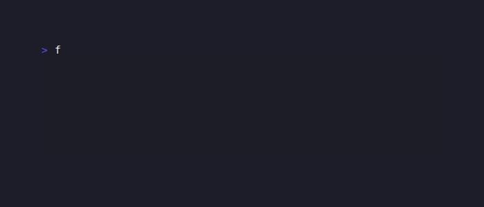
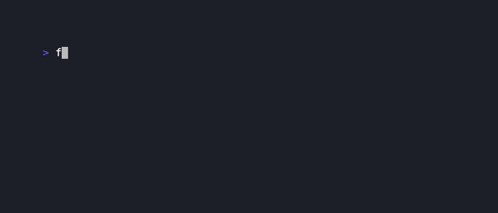
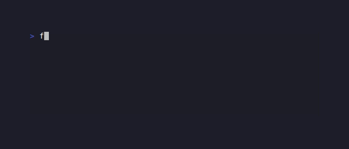
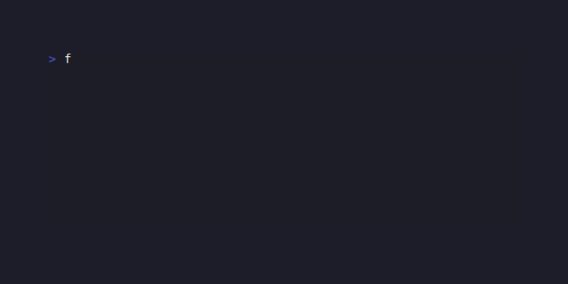
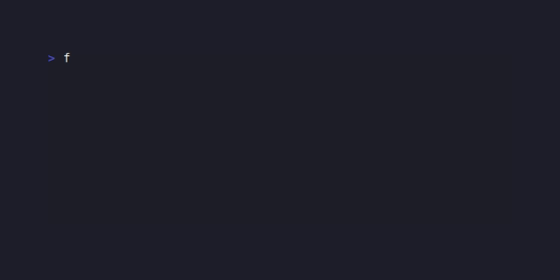
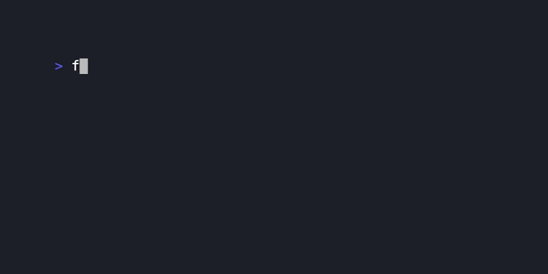
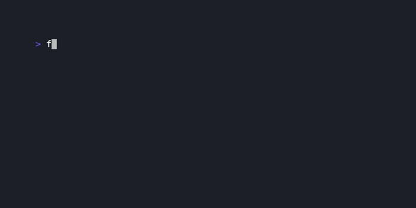
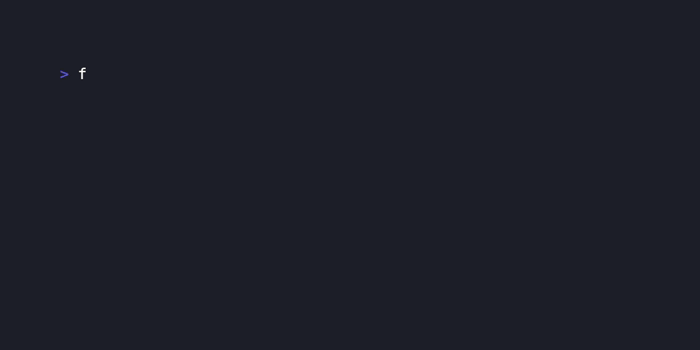
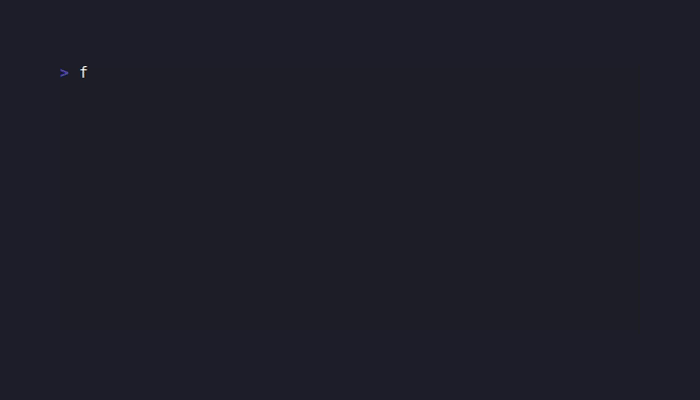

# dart\_tui examples

A complete port of the [Bubble Tea](https://github.com/charmbracelet/bubbletea) example gallery, implemented with `dart_tui`.

GIFs are recorded with [VHS](https://github.com/charmbracelet/vhs). Run `vhs example/tapes/<name>.tape` from the project root to regenerate any recording.

---

## Foundations

### simple

A 5-second tick-driven countdown that auto-quits when it reaches zero. Demonstrates the `tick()` command and minimal model lifecycle.


```bash
dart run example/simple.dart
```

---

### window\_size

Displays the current terminal dimensions (columns × rows) using `WindowSizeMsg`. Press `q` to quit.



```bash
dart run example/window_size.dart
```

---

### fullscreen

Runs a countdown inside the alternate screen buffer, keeping the normal terminal history clean. Auto-quits at zero.


```bash
dart run example/fullscreen.dart
```

---

### set\_window\_title

Sets the terminal window/tab title via an ANSI escape sequence. Demonstrates `setWindowTitle`. Press `q` to quit.


```bash
dart run example/set_window_title.dart
```

---

### altscreen\_toggle

Toggles between the normal screen and the alternate screen buffer each time you press Space. Press `q` to quit.


```bash
dart run example/altscreen_toggle.dart
```

---

### vanish

Demonstrates the "vanish" pattern: the program renders nothing on exit so it leaves no visible output in the scrollback. Press Enter to quit cleanly.


```bash
dart run example/vanish.dart
```

---

## Text Input

### textinput

A single-line text field with placeholder text and cursor navigation. Press Enter to submit the value, `q` to quit.


```bash
dart run example/textinput.dart
```

---

### textinputs

Three stacked text fields — name, email, and password — navigated with Tab. Password field masks its characters. Press Ctrl+C to exit.


```bash
dart run example/textinputs.dart
```

---

### textarea

A multi-line scrollable text editor backed by `TextareaModel`. Supports newlines, wrapping, and standard cursor movement. Press Ctrl+C to quit.


```bash
dart run example/textarea.dart
```

---

### autocomplete

A text input with inline ghost-text completion. Start typing to trigger a suggestion; press Tab to accept it. Press `q` to quit.



```bash
dart run example/autocomplete.dart
```

---

## Lists & Selection

### list\_simple

A bare-bones scrollable list using `ListModel` without extra chrome. Navigate with arrow keys; press `q` to quit.


```bash
dart run example/list_simple.dart
```

---

### list\_default

A styled list with title, status bar, and help footer. Navigate with arrows and press Enter to select an item. Press `q` to quit.


```bash
dart run example/list_default.dart
```

---

### result

Selects an item from a list and returns the chosen value to the calling code. Shows how to use `Program.run` return value. Navigate and press Enter to confirm.


```bash
dart run example/result.dart
```

---

### paginator

A dot-indicator paginator that lets you page through a set of items. Use Left/Right arrows to move between pages. Press `q` to quit.


```bash
dart run example/paginator.dart
```

---

## Table

### table

A scrollable data table with column headers and highlighted rows. Navigate rows with Up/Down arrows. Press `q` to quit.


```bash
dart run example/table.dart
```

---

### package\_manager

Simulates installing a list of packages, each with its own animated progress bar. Runs to completion automatically.


```bash
dart run example/package_manager.dart
```

---

## Spinners & Progress

### spinner

A single animated spinner with a "Loading…" prefix. Demonstrates `SpinnerModel` with a 100 ms tick interval. Press `q` to quit.


```bash
dart run example/spinner.dart
```

---

### spinners

Displays all built-in spinner styles side-by-side so you can compare their animation patterns. Press `q` to quit.


```bash
dart run example/spinners.dart
```

---

### progress\_bar

A manually-driven progress bar. Use Right/Left arrows to increase or decrease the fill percentage. Press `q` to quit.


```bash
dart run example/progress_bar.dart
```

---

### progress\_animated

An auto-incrementing progress bar driven by ticks. Watch it fill from 0 % to 100 % and quit automatically.



```bash
dart run example/progress_animated.dart
```

---

## Composition & Views

### composable\_views

Composes a `TimerModel` and a `SpinnerModel` inside a single parent model, demonstrating how to delegate `update` calls to sub-models.


```bash
dart run example/composable_views.dart
```

---

### tabs

A tabbed interface with Left/Right arrow navigation. Each tab shows different content; the active tab is highlighted. Press `q` to quit.


```bash
dart run example/tabs.dart
```

---

### views

A two-phase view: an initial screen transitions to a second view after pressing Enter, then counts down before quitting. Press `q` at any time.


```bash
dart run example/views.dart
```

---

### pager

A scrollable viewport over a long body of text. Use Up/Down arrows (or j/k) to scroll. Press `q` to quit.


```bash
dart run example/pager.dart
```

---

## Keyboard & Mouse

### print\_key

Echoes every key press to the screen in real time, including modifier combinations and special keys. Press Escape to quit.


```bash
dart run example/print_key.dart
```

---

### cursor\_style

Cycles through the available terminal cursor shapes (block, underline, bar) with Right arrow. Toggle blink with Space. Press `q` to quit.



```bash
dart run example/cursor_style.dart
```

---

### mouse

Enables mouse tracking and displays click coordinates and button events as you interact. Press `q` to quit.


```bash
dart run example/mouse.dart
```

---

## Async & Real-time

### realtime

Fires a background `Future` from `init` and displays its result when it completes, showing async message delivery. Press `q` to quit.



```bash
dart run example/realtime.dart
```

---

### send\_msg

Demonstrates sending messages from outside the model loop using a ticker that fires on an independent `Timer`. Press `q` to quit.


```bash
dart run example/send_msg.dart
```

---

### timer

A 1-minute countdown `TimerModel` demo. Press `s` to start/stop, `r` to reset, and `q` to quit.



```bash
dart run example/timer.dart
```

---

### stopwatch

An elapsed-time `StopwatchModel` demo. Press `s` to start/stop, `r` to reset, and `q` to quit.


```bash
dart run example/stopwatch.dart
```

---

## Events & System Integration

### focus\_blur

Listens for terminal focus and blur events (sent by supporting terminals via escape sequences) and displays the current focus state.



```bash
dart run example/focus_blur.dart
```

---

### prevent\_quit

Intercepts Ctrl+C twice before allowing the program to exit, demonstrating how to override default quit behaviour. Press `q` to force-quit.


```bash
dart run example/prevent_quit.dart
```

---

### sequence

Issues a batch of commands in strict sequence using `Cmd.sequence`, showing each step complete before the next begins. Runs to completion automatically.


```bash
dart run example/sequence.dart
```

---

### exec\_cmd

Suspends the TUI, launches an external command (e.g. an editor), and resumes when the subprocess exits. Press `q` to quit.


```bash
dart run example/exec_cmd.dart
```

---

### pipe

Reads from stdin when the program is used in a pipeline (e.g. `echo "hello" | dart run example/pipe.dart`), displaying the piped content.



```bash
echo "hello world" | dart run example/pipe.dart
```

---

### http

Makes an HTTP GET request while showing a spinner, then displays the response body. Demonstrates async commands with `Cmd`. Press `q` to quit.


```bash
dart run example/http.dart
```

---

### file\_picker

An interactive file-system browser. Navigate directories with arrows, Enter to descend, Escape to go up. Press `q` to quit.


```bash
dart run example/file_picker.dart
```

---

### help

Renders a compact key-binding help bar at the bottom of the screen. Press `?` to expand it to a full help view and again to collapse. Press `q` to quit.


```bash
dart run example/help.dart
```

---

### color\_profile

Detects the terminal color profile (TrueColor, 256-color, ANSI, or no color) and renders a colour swatch for each supported level.



```bash
dart run example/color_profile.dart
```

---

### isbn\_form

A validated form that accepts an ISBN-13 number, checks the check digit in real time, and shows a pass/fail indicator. Press Ctrl+C to quit.


```bash
dart run example/isbn_form.dart
```

---

## Bonus Examples

### shopping\_list

The classic Bubble Tea "getting started" tutorial ported to Dart. A checkbox list of grocery items; navigate with arrows and toggle with Space. Press Enter to confirm.


```bash
dart run example/shopping_list.dart
```

---

### prompts\_chain

Chains `promptSelect` → `promptConfirm` → `promptInput` in sequence, each running its own `Program`. Shows how the prompt helpers compose together.


```bash
dart run example/prompts_chain.dart
```

---

### all\_features

A guided tour of every dart\_tui widget and API in a single file. Pages through spinners, progress bars, text inputs, lists, tables, and more.


```bash
dart run example/all_features.dart
```

---

### showcase

A comprehensive interactive demo that lets you navigate between themed sections demonstrating the full dart\_tui component library.


```bash
dart run example/showcase.dart
```

---

## Recording GIFs

Install [VHS](https://github.com/charmbracelet/vhs) and run any tape file from the project root:

```bash
# Record a single example
vhs example/tapes/spinner.tape

# Record all examples
for tape in example/tapes/*.tape; do vhs "$tape"; done
```

GIF output goes to `example/tapes/output/`. The `output/` directory is git-ignored (only the `.gitkeep` placeholder is tracked).
